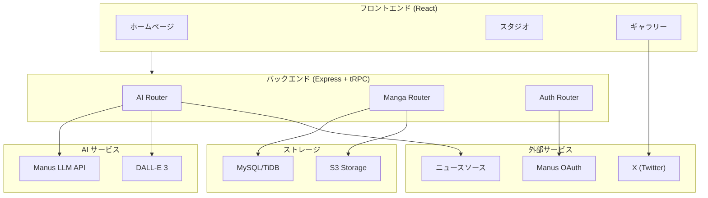
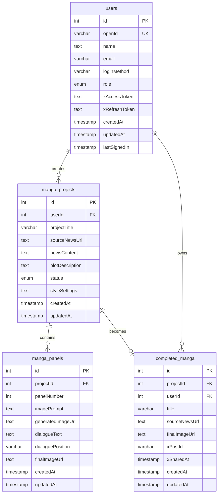

# AI漫画クリエイター


## 概要

**AI漫画クリエイター**は、最新ニュースをAIの力で本格的な漫画に自動変換するフルスタックWebアプリケーションです。ニュース記事を選択するだけで、AIがストーリーを生成し、漫画パネルを作成し、セリフを配置して、完成した漫画をダウンロードまたはX（Twitter）で共有できます。

## 主な機能

| 機能 | 説明 |
|------|------|
| **ニュース自動取得** | 複数のメディアソースから最新ニュース記事を5件自動取得 |
| **ストーリー生成** | ニュース内容を分析し、3つの異なるプロット提案を生成 |
| **パネル自動生成** | 選択したストーリーから4〜6コマの漫画パネルプロンプトを自動生成 |
| **高品質画像生成** | DALL-E 3を使用した高品質な漫画画像生成、前のパネルを参照して視覚的一貫性を確保 |
| **セリフ編集** | 各パネルのセリフをリアルタイムで編集可能 |
| **JPEG出力** | 完成した漫画をJPEG形式でダウンロード |
| **ギャラリー保存** | 作成した漫画をギャラリーに保存・管理 |
| **X共有** | 完成した漫画をX（Twitter）で直接共有 |
| **ユーザー認証** | Manus OAuthによる安全なユーザー認証 |

## ワークフロー

アプリケーションは以下のステップバイステップのワークフローでユーザーを漫画制作プロセスにガイドします：

```
ニュース選択 → ストーリー生成 → パネル作成 → セリフ編集 → プレビュー・エクスポート
```

### ステップ1: ニュース選択
複数のニュースソースから取得した最新記事5件から、漫画化したいニュースを選択します。

### ステップ2: ストーリー生成
AIがニュース内容を分析し、3つの異なるストーリー提案を生成します。各提案にはタイトル、プロット説明、パネル数、キーテーマが含まれます。

### ステップ3: パネル作成
選択したストーリーに基づいて、4〜6コマの漫画パネルを生成します。各パネルには画像プロンプト、シーン説明、推奨セリフが含まれます。

### ステップ4: セリフ編集
生成されたセリフを確認・編集し、ストーリーをカスタマイズします。

### ステップ5: プレビュー・エクスポート
完成した漫画をプレビューし、JPEGでダウンロードするか、ギャラリーに保存するか、Xで共有します。

## 技術仕様

### フロントエンド
- **フレームワーク**: React 19 + TypeScript
- **スタイリング**: Tailwind CSS 4
- **UIコンポーネント**: shadcn/ui
- **ルーティング**: Wouter
- **状態管理**: TanStack Query
- **API通信**: tRPC

### バックエンド
- **ランタイム**: Node.js + Express 4
- **API**: tRPC 11
- **データベース**: MySQL/TiDB (Drizzle ORM)
- **認証**: Manus OAuth
- **ストレージ**: S3互換ストレージ

### AI/ML統合
- **LLM**: Manus LLM API（ストーリー生成、パネルプロンプト生成）
- **画像生成**: DALL-E 3（漫画パネル画像生成）
- **画像合成**: Node.js Canvas（JPEG出力）

## アーキテクチャ



## データベーススキーマ



## API エンドポイント

### AI Router (`/api/trpc/ai.*`)

| エンドポイント | 説明 |
|---------------|------|
| `fetchLatestNews` | 最新ニュース5件を取得 |
| `extractNews` | ニュースURLからコンテンツを抽出 |
| `generateStoryProposals` | ストーリー提案を3件生成 |
| `generatePanelPrompts` | パネルプロンプトを生成 |
| `generateImage` | 漫画パネル画像を生成 |
| `getImageAsBase64` | 画像をBase64形式で取得 |

### Manga Router (`/api/trpc/manga.*`)

| エンドポイント | 説明 |
|---------------|------|
| `createProject` | 新規プロジェクト作成 |
| `getProject` | プロジェクト詳細取得 |
| `updateProject` | プロジェクト更新 |
| `createPanel` | パネル作成 |
| `getProjectPanels` | プロジェクトのパネル一覧取得 |
| `updatePanel` | パネル更新 |
| `completeManga` | 漫画を完成状態に |
| `getGallery` | ギャラリー一覧取得 |
| `generateJPEG` | JPEG画像生成 |
| `shareToX` | X共有情報を記録 |

## 環境変数

以下の環境変数はManus Platformによって自動的に設定されます：

| 変数名 | 説明 |
|--------|------|
| `DATABASE_URL` | データベース接続文字列 |
| `JWT_SECRET` | セッションCookie署名用シークレット |
| `VITE_APP_ID` | Manus OAuthアプリケーションID |
| `OAUTH_SERVER_URL` | Manus OAuthバックエンドURL |
| `VITE_OAUTH_PORTAL_URL` | Manusログインポータル URL |
| `BUILT_IN_FORGE_API_URL` | Manus組み込みAPI URL |
| `BUILT_IN_FORGE_API_KEY` | Manus組み込みAPIキー |

## 開発

### 前提条件
- Node.js 22+
- pnpm 10+

### セットアップ
```bash
# 依存関係のインストール
pnpm install

# データベースマイグレーション
pnpm db:push

# 開発サーバー起動
pnpm dev
```

### テスト
```bash
pnpm test
```

### ビルド
```bash
pnpm build
```

## ライセンス

MIT License

## クレジット

- **開発**: Manus AI
- **プラットフォーム**: Manus Platform
- **AI**: OpenAI DALL-E 3, Manus LLM API
